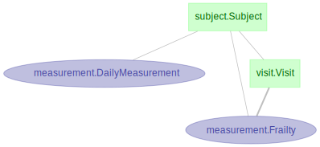

# Activity tracker



### Create a virtual environment with:

```bash
conda env create -f environment.yml
```

## Contribution Guidelines

If you plan to contribute to this repository, follow these steps:

1. Fork the repository and create a new branch for your changes:

```bash
git checkout -b your-branch-name
```

2. Install development dependencies:

```bash
pip install .[dev]
```

3. Set up pre-commit hooks:

```bash
pre-commit install
```

4. Commit your changes and open pull request with a clear description of changes.
